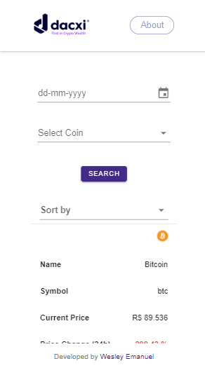
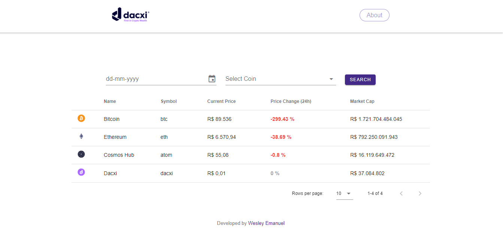

<h1 align="center">Dacxi Frontend Test</h1>
<h3 align="center">Cotação histórica e em tempo real do Bitcoin</h3>

## 📸 Screenshots da aplicação:
<div>
  
  
</div>

</br>
<p align="center">
  <a href="linkedin.com/in/wesley-emanuel-alves-de-oliveira-7b05781b9">Linkedin</a>&nbsp;&nbsp;&nbsp;|&nbsp;&nbsp;&nbsp;
  <a>Email: dev.wesleyalves@gmail.com</a>&nbsp;&nbsp;&nbsp;|&nbsp;&nbsp;&nbsp;
  <span>(85) 98514-1683</span>
</p> </br>

### 📝 Sobre o projeto:
O desafio era fazer um site para visualização dos preços do Bitcoin e outras criptomoedas na data atual ou em outras datas pesquisadas pelo usuário.
A aplicação foi desenvolvida com VueJs, como exigido nos requisitos, fazendo também uso do framework Vuetify. Utilizei o conceito mobile first e deixei o site responsivo para variados tamanhos de tela. Além disso, utilizei a API da CoinGecko para fazer as requisições com axios, buscando os dados históricos e atuais das criptomoedas. Foi um desafio muito enriquecedor. Agradeço a Dacxi pela oportunidade e espero que também gostem do resultado.

## 💻 Tecnologias utilizadas:
- VueJs
- Javascript
- HTML
- CSS
- Vuetify
- Axios

## 🏃🏻‍♂️ Como executar o Projeto

### 🔧 Instalando as Dependências:
```
npm install
```

### 🔥 Executar a aplicação VueJs em ambiente de desenvolvimento:
```
npm run serve
```

### 🌎 Compilação para Produção:
```
npm run build
```

</br>
<p align="center">
  <a href="linkedin.com/in/wesley-emanuel-alves-de-oliveira-7b05781b9">Linkedin</a>&nbsp;&nbsp;&nbsp;|&nbsp;&nbsp;&nbsp;
  <a>Email: dev.wesleyalves@gmail.com</a>&nbsp;&nbsp;&nbsp;|&nbsp;&nbsp;&nbsp;
  <span>(85) 98514-1683</span>
</p> </br>
